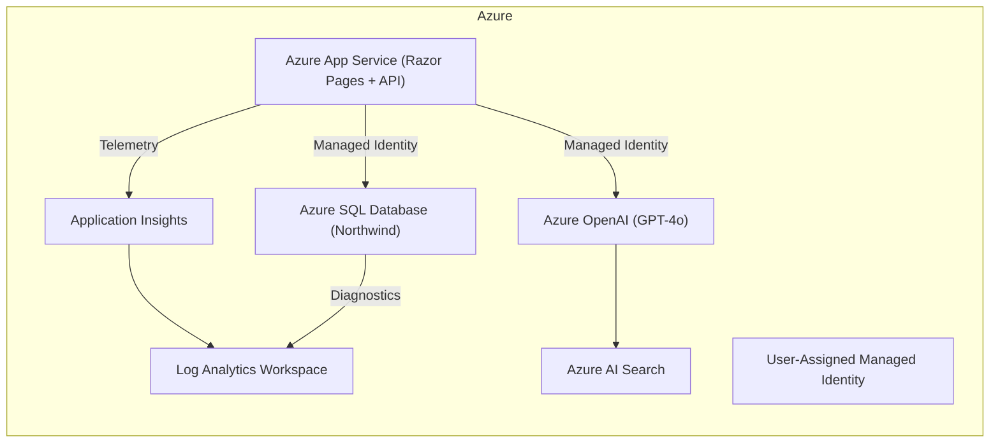

## Architecture

The deployment scripts create the App Service, SQL Database, managed identity, monitoring, and optional GenAI resources. All service-to-service calls use the managed identity—no secrets are stored in code or configuration.
